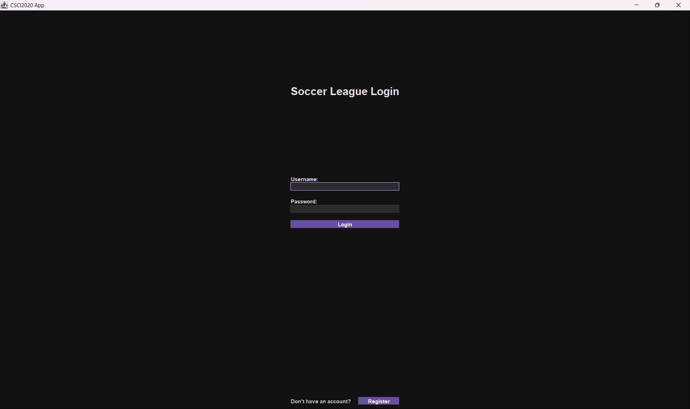
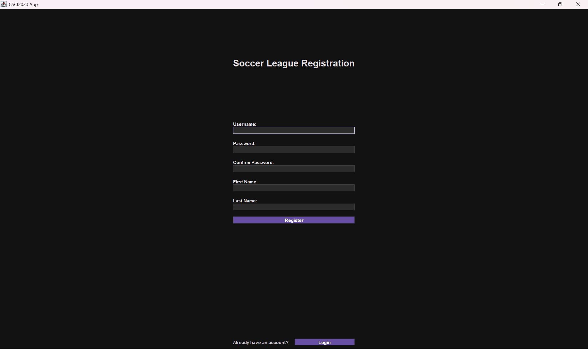
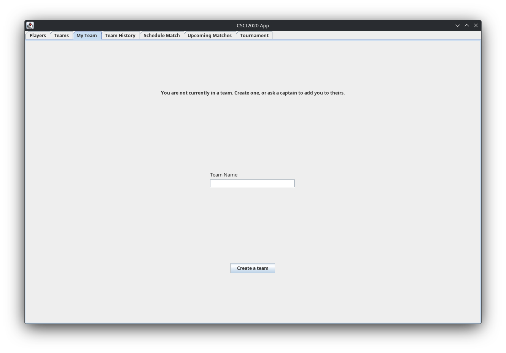
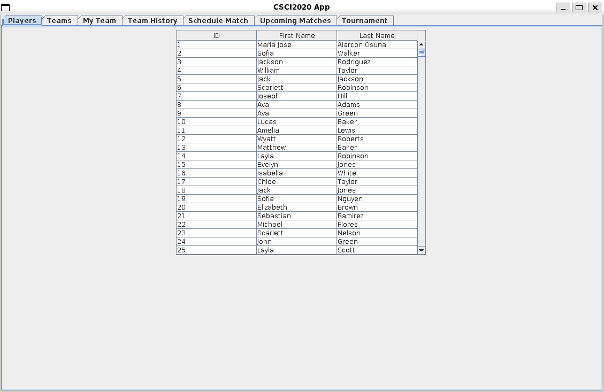
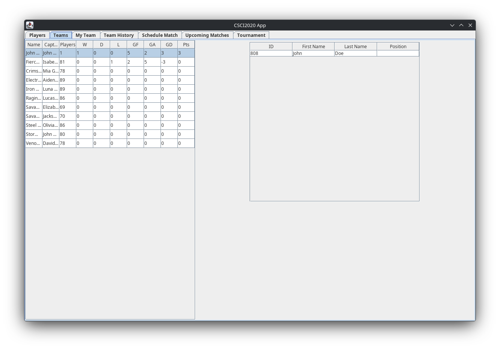
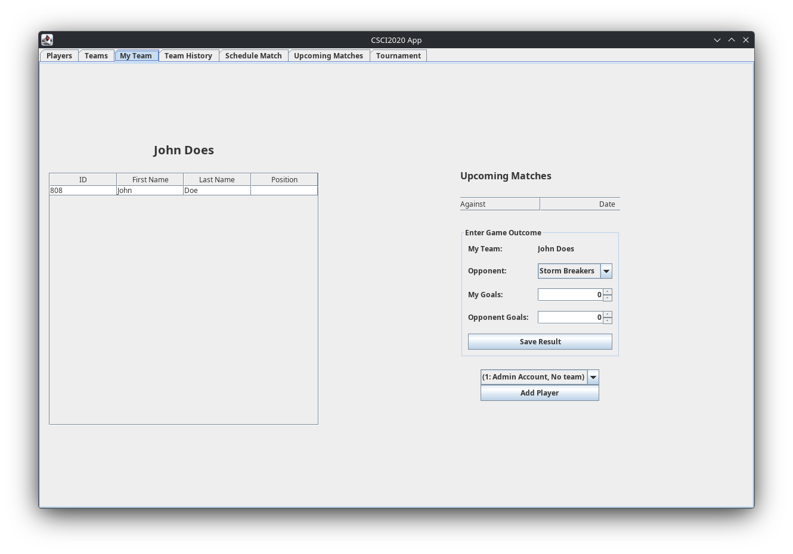
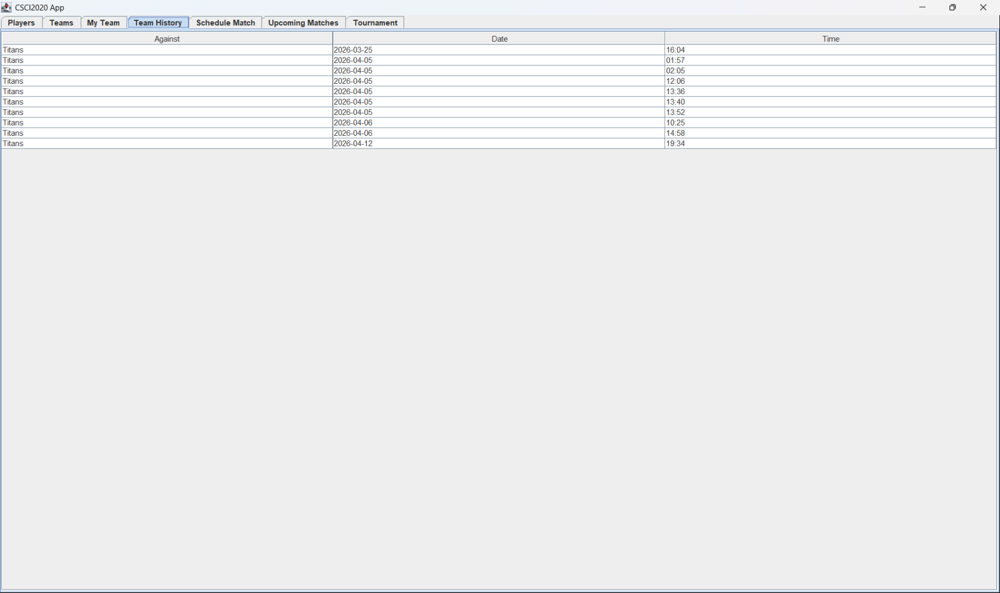
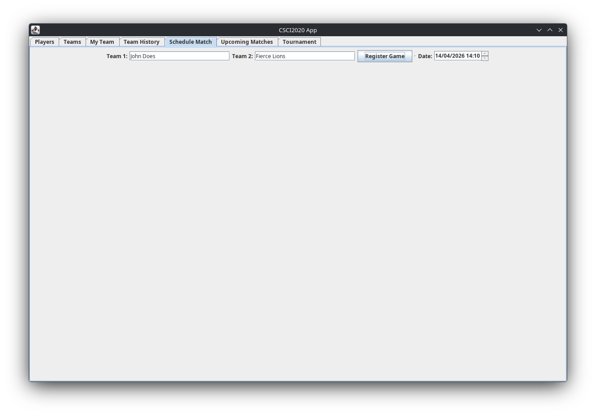
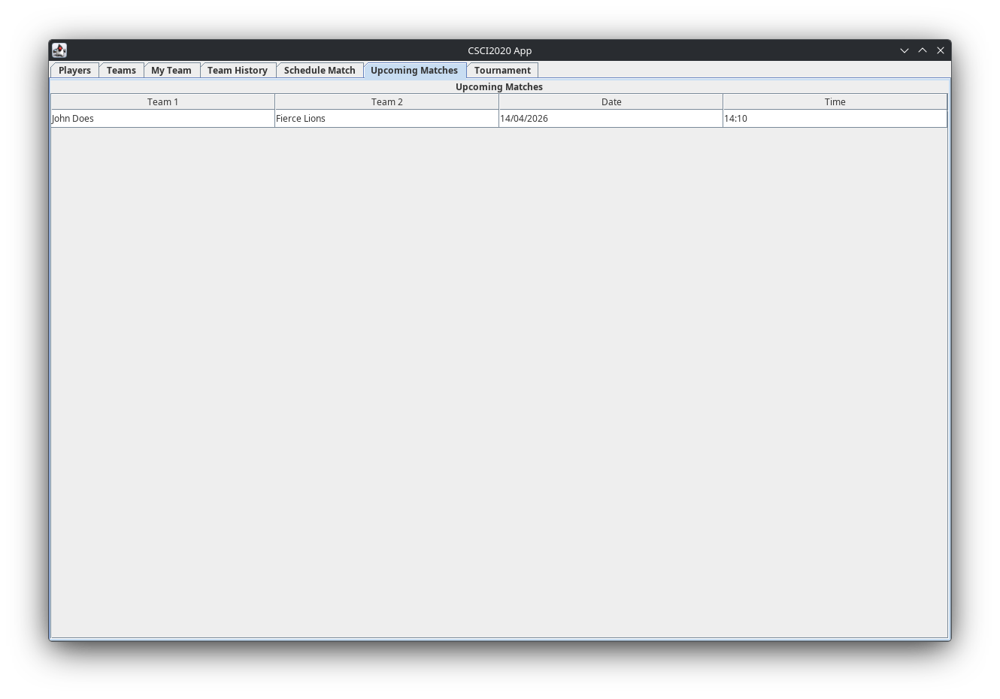
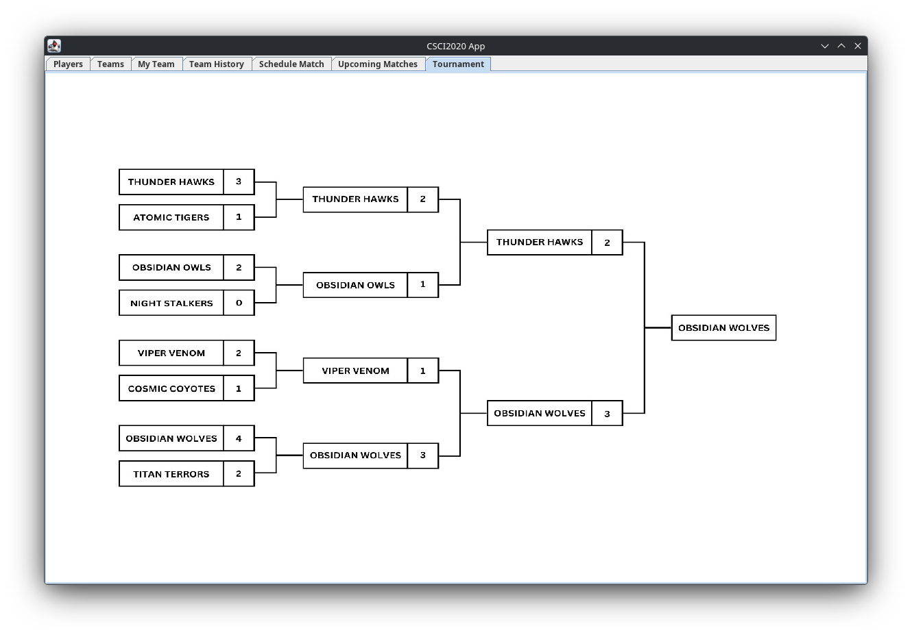

# Soccer Manager
A sports league registration and management system, supporting accounts of three different types: players, captains, and administrators. Admin users can login or create a new account when they run the app and once logged in, can create their own teams with a name of their choosing, and can then add teamless players to their teams through the roster management menu, where a user can also see their roster and input the final score of matches against other teams. Admins can then schedule matches with other teams in the 'Schedule Match' tab with their desired date and time. All users can view their upcoming matches and their game history in the 'Upcoming Matches' and 'Game History' tabs respectively. Any user can view their own team in the 'My Team' tab and all teams currently registered by navigating to the 'Teams' tab. 

# Features

- Account management
- Signing up for accounts
- Creation and joining of teams
- Kicking players from your team
- Scheduling matches with other teams
- Match History Menu
- Tournament Mode

# Installation

## Option A: Maven
> [!IMPORTANT]  
> Make sure Maven is installed and available on your path. This should be available from within your package manager.

#### Step 1

`mvn package`

#### Step 2

Copy `target/ProjectTest-1.0-SNAPSHOT.jar` to a directory of your choosing

#### Step 3

Run `java -jar ProjectTest-1.0-SNAPSHOT.jar` in that directory.

# Setup Instructions for Users
* 1: When opening the app you will arrive at the login screen. If you already have an account, fill in your credentials in the fields provided and press 'Login' to continue. If you do not have an account, begin at the second step of instructions.

<p align="center">
  
</p>

* 2: (If you do not have an account): Press the 'Register' button at the bottom of the page on the Login page. You will be taken to the registration page where you must enter your username, password, and first and last name. press register to create your account. 
  * After registering, return to the login screen and enter your Username and Password. Press 'Login' to continue.
  
<p align = "center">
  
</p>

* 3: After logging in you will arrive at the main menu. You can navigate through each section of the app using the tabs located at the top right of the page. Navigate to the 'My Team" tab. Here you can create your team or request to be added to an existing team. Fill in the field and press 'Create a Team' to create your team.

<p align="center">
  
</p>

* 4: You can find the added players on the 'Player' tab.

<p align="center">
  
</p>

* 5: Next to the 'Players' tab, you can find the teams that have been added, with their individual team stats, and their team captain.

<p align="center">
  
</p>

* 6: In the 'My Team' tab you can see the team you are part of, as well as the rest of your teammates. Inside this tab you can add the outcomes of past matches you have had. If admin, you will see the option to add a new player to the team.

<p align="center">
  
</p>

* 7: In the 'Team History' tab you will be able to see the past matches your team has played.

<p align="center">
  
</p>

* 8: To schedule a match, you can go to the 'Schedule Match' tab, in here you will have to add both teams names, and pick a date when the game will be played.

<p align="center">
  
</p>

* 9: After scheduling a match, you can go to the 'Upcoming Games' tab, where you will be able to see the day and time the match will be played by.

<p align="center">
  
</p>

* 10: Finally the 'Tournament' tab shows how a simulation of a tournament would look like. This works by registering games and outcomes as you normally would. But you do require help from an admin in order to create a torunament.

<p align="center">
  
</p>

# Instructions on how to test/run program:
> [!IMPORTANT]  
> Make sure Maven and Java is installed and available on your path. This should be available in your distributions package manager or winget.

## Unix:
### 1st Step:
```bash
./Unix/build.sh
```

#### If error "Permission denied":
```
chmod +x ./Unix/*.sh
```
### 2nd Step:
```
./Unix/run.sh
```
or 
```
./Unix/test.sh
```
## Windows:
### 1st Step:
```bat
build.bat
```
### 2nd Step:
```
run.bat
```
or
```
test.bat
```

