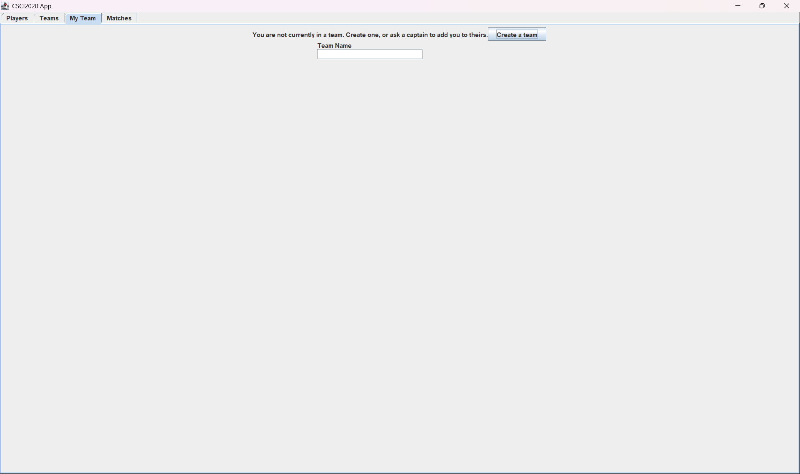

# Soccer Manager
TODO

# Features

TODO

# Installation

TODO

# Usage

TODO

# Setup Instructions for Users
- When opening the app you will arrive at the login screen. If you already have an account, fill in your credentials in the fields provided and press 'Login' to continue. If you do not have an account, begin at the second step of instructions.

  

- (If you do not have an account) Press the 'Register' button at the bottom of the page on the Login page. You will be taken to the registration page where you must enter your username, password, and first and last name. press register to create your account.
  - After registering, return to the login screen and enter your Username and Password. Press 'Login' to continue.

  

- After logging in you will arrive at the main menu. You can navigate through each section of the app using the tabs located at the top right of the page. Navigate to the 'My Team" tab. Here you can create your team or request to be added to an existing team. Fill in the field and press 'Create a Team' to create your team.

  

