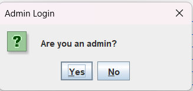
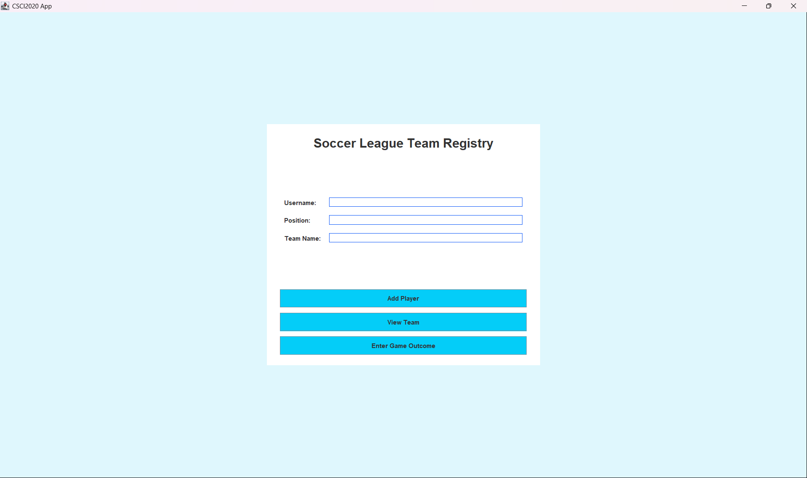

# Soccer Manager
TODO

# Features

TODO

# Installation

TODO

# Usage

TODO

# Setup Instructions for Users
- When opening the app, you will be met with a login screen. Fill in the required fields with your information and press the 'Register' button to create a new account. If you have already created an account, press the 'Login' button instead.

  

- After logging in, choose if your account is an admin account or a regular account on the appearing panel:

  

  - If you choose admin status, you will be brought to the team registry screen. Fill in the fields and press 'Add Player'. From there you can look at the team rosters using the 'View Team' button or entering an outcome of a completed game using the 'Enter Game Outcome' button.

  

